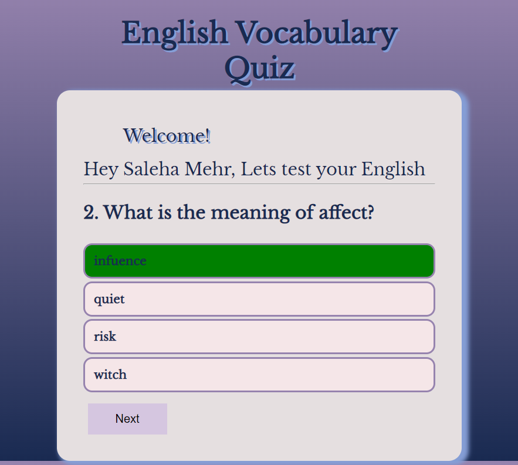
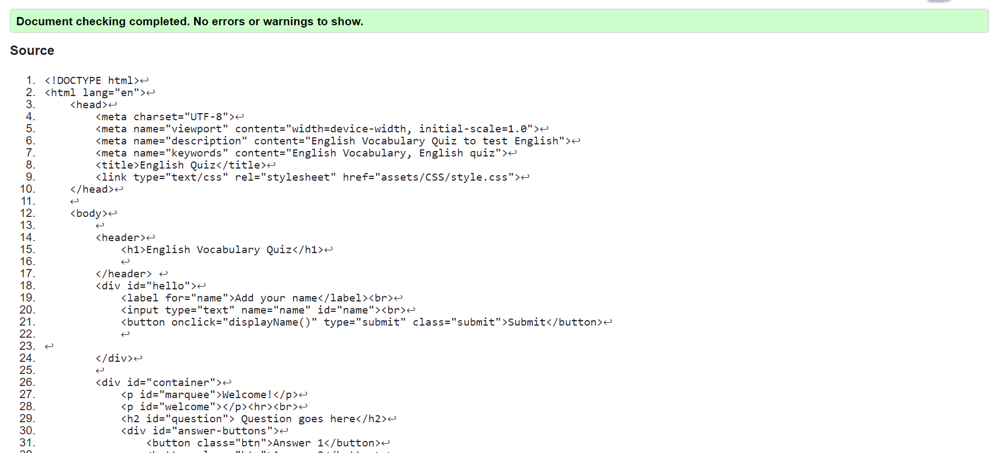

# English Vocabulary Quiz

English Vocabulary quiz is a simple quiz that is designed to test English vocabulary. It easy and simple to use. This quiz includes ten question and each question has four options that one of them is correct and the others are wrong. By selecting an answer you will realize if your answer is wrong or not and the correct answer. You can add a username and choose the correct option that is provided for each question.
A live version of the webpage can be foound here - https://saleha-m14.github.io/My-Second-Project-Quiz/

# Table of contents

0. [Introduction](#introduction "Introduction")
1. [Project Goals](#project-goals "ProjectGoals")
   + [User Goals](#user-goals "User Goals")
   + [Site Owner Goals](#site-owner-goals "Site Ower Goals")
2. [User Experience](#user-experience "User Experience")
   + [Target Audience](#target-audience "Target Audience")
   + [User Requirements and Expectations](#user-requirements-and-expectations "User Requirements and Expections")
   + [User Stories](#user-stories "User Stories")
3. [Design](#design "Design") 
   + [Design Choices](#design-choices "Design Choices")
   + [Colour](#colour "Colour")
   + [Fonts](#fonts "Fonts")
4. [Technologies Used](#technologies-used "Technologies Used")
   + [Languages](#languages "Languages")
   + [Frameworks & Tools](#frameworks-and-tools "Frameworks & Tools")
5. [Features](#features "Features")
   + [Existing Features](#existing-features "Existing Features")
      + [Start Screen](#start-screen "Start Screen")
      + [Quiz Screen](#quiz-screen "Quiz Screen")
      + [Score Screen](#score-screen "Score Screen")

6. [Testing](#testing "Testing")
   + [Html Validation](#html-validation "Html Validation")
   + [CSS Validation](#css-validation "CSS Validation")
   + [Accessibility](#accessibility "Accessibility")
   + [Performance](#performance "Performance")
   + [Device Testing](#device-testing "Device Testing")
   + [Browser Compatibility](#browser-compatility "Browser Compatility")
   + [Testing User Stories](#testing-user-stories "Testing User Stories")
7. [Bugs](#bugs "Bugs")
8. [Deployment](#deployment "Deployment")
9. [Credits](#credits "Credits")

# Introduction

Test English Vocabulary is a website that help users to test their English vocabulary and undrestand their level of English.
It is designed for those who are eager to improve their knowledge and learn new words in English.

## Project Goals

The goal of this project is to create a quiz that tests users English vocabulary and help them learn new words to improve their English language skills.

### User Goals

+ To test their English Vocabulary
+ Be able to learn new words and their meaning in English
+ realize the correct option for each question
+ display the score

### Site Owner Goals

+ Develop a Javascript quiz platform
+ Make the design simple and user friendly
+ Make the page responsive and accessible
+ Provide fast and Engaging content to users
+ let the users add their usernames
+ Help users learn new words and meanings in English
+ let the user know the correct option
+ display the scores
+ try again option after showing scores

## User Experience 

### Target Audince

+ Those who want to be challenged and entertained
+ Those who are interested to learn new words and improve their language skills
+ Those who want to test their English vocabulary
+ Those who are eager to learn new English words with meanings in English

### User Requirements and Expectations 

+ Input for user name
+ Webpage that has a simple and attractive design
+ Useful words
+ Responsive on different screen sizes
+ Display the score

### User Stories

+ I want to user to feel challenged
+ I want the user to undrestand if the answer is write or wrong
+ I want the user to see the write answer for each question to learn them
+ I want the user to be able to add a user name

## Design

This site is designed to engaging and simple quiz platform.

### Colour

The color palette was created using [Coolors](https://coolors.co
)
The colors that are used to design this site are eye-catching and the contexts are easily readable.

### Fonts 

Fonts that are chosen for this website is Libre Baskerville from [Google fonts](https://fonts.google.com/) with a fall back of serif. That is readble.

### Structure

## Technologies Used

### Languages 

+ HTML
+ CSS
+ Javascript

### Frameworks & Tools

## Features

This quiz webpage includes three pages:
  - Start Screen
  - quiz Screen
  - Score Screen
When the user type username and submit it then can choose the right answer of the question. When the questions end the score screen will display.

### Existing Features

#### Start Screen

The start screen has a header and a paragraph that says hello and asks to add username and a submit button to submit the username. When the user add username and submit it then the username input field and submit button will disappear and a message will be shown that calls the username to test their English.

#### Quiz Screen 

The quiz screen has a header that is on the top of the page and a div with an id of container that includes a welcome message and message that calls username to test his/her English vocabulary. If the user does not submit their username this message will not show and the user is still able to pass the quiz even without adding a name. Below that the question and four answers will display. By selecting an answer for the first question the next button will show that enables users to access the other questions of the quiz.

#### Score Screen

The score screen has a title that says the end and a message that says user have completed the quiz and below that a good will display and after that the score will be visible. In the bottom of the screen their is a replay button that if the user wanted to pass the quiz again this button will take them to quiz screen.

### Testing

List of the main issues:
+ The question was displaying and the answers was not displaying.
  + When getting the answer buttons div element the id had a spelling mistake. I did not notice it at first but after checking my code for the fourth time I noticed that the id has a spelling mistake I mean it was not the exact thing that was added to the answers div container.
+ The username input field and submit button was displaying even after submitting the username and when the username was on quiz screen and selecting an option the username input was on the top of the quiz container.
  + For solving this problem I moved the p element input field and submit button inside a div with id of hello and then add a variable in javascript file to get that div and displayed the whole div to none. When the user clicks on submit button. That way it disapeared after submitting username.  
+ The user did not know if the answer he/she had selected is worng or not.
  + The solution for this problem was adding correct and incorrect classes for answer buttons and if the selected answer dataset is true then the answer is correct and if false the answer is incorrect I added a color green for correct class and red for incorrect class name.
+ I had added the background colour green for the correct class and red for incorrect class but it was not displaying I did not know how to solve the problem so I asked the tutor section for guidance and he said that I need to write it more specifically then I called the button's class name and then correct class name and that way it was solved.
+ The user could not access the questions except the first question.
  + I added a button and the button is displayed to none when the user select an answer for the first question the next button is displayed to block and the user can click on it and go to the next question.
+ While testing with W3C validator there was an error that the paragraph that is inside the marquee element can not be a child of the div element. 
  + Therefore I moved it to the top of the page inside the header and when I tested it again said that it can not be inside header so I moved it above header.
+ 

Apart from these issues that I mentioned there have been several minor issues. The majority of these issues have been due to miss spelled tags, attributes, closing tags, and other mistakes.

### Validator Testing

- HTML
  - No errors were returned when passing through the official [W3C Validator](https://validator.w3.org/nu/?doc=https%3A%2F%2Fangelicaguimaraes.github.io%2Fmagnolia_tree%2Findex.html)

  

- CSS
  - No errors were returned when passing through the official [(Jigsaw validator)](http://jigsaw.w3.org/css-validator/validator?lang=en&profile=css3svg&uri=https%3A%2F%2Fangelicaguimaraes.github.io%2Fmagnolia_tree%2Findex.html&usermedium=all&vextwarning=&warning=1)

-JSHint Testing

- lighthouse testing

### Unfixed Bugs

- All bugs were fixed and added to testing.

## Deployment & Usage

### Remote Deployment
The site was deployed to GitHub pages. To deploy the website, the following steps were taken:
* In the GitHub repository, navigate to the Settings tab
* On the left side menu, on the section Code and automation, click on Pages.
* From the source section drop-down menu, select the Deploy from a branch.
* From the branch section drop-down menu, select main, right on the side select /root.
* Once the the branch menus have been selected, github will create the page. It might take a few minutes. Once it is done a link will show up on the top of the page.

### How To Fork
To fork the repository:
* Log in (or sign up) to [Github](https://github.com/).
* Go to the repository for this project: [Fem Code](https://github.com/panzek/fem-code).
* Click the Fork button in the top right corner.

### How To Clone

To clone the repository:
* Log in (or sign up) to [Github](https://github.com/).
* Go to the repository for this project: [Fem Code](https://github.com/panzek/fem-code).
* Click on the code button, select whether you would like to clone with HTTPS, SSH or GitHub CLI and copy the link shown.
* Open the terminal in your code editor and change the current working directory to the location you want to use for the cloned directory.
* Type 'git clone' into the terminal and then paste the link you copied in step 3.
* Press enter.

 

The live version of the project is deployed at GitHub pages.

The procedure for deployment followed the "Creating your site" steps provided in [GitHub Docs.](https://docs.github.com/en/pages/getting-started-with-github-pages/creating-a-github-pages-site)

1. Log into GitHub.
2. Locate the GitHub Repository that shall be deployed live.
3. At the top of the repository, select Settings from the menu items.
4. Scroll down the Settings page to the ”GitHub Pages" section and click on the ”Check it out here!”
5. At the ”Source” section choose ”main” as Branch and root as folder and click ”Save”
6. The website will deploy and the pages refreshes to provide the live link to the project.

The live link can be found here - https://saleha-m14.github.io/My-Second-Project-Quiz/

# Credits 

The over all idea of what to work on as the second project was inspired by [how to make a quiz app](https://youtu.be/2jwdyO_UunE)

I learned how to add [linear gradient background](https://developer.mozilla.org/en-US/docs/Web/CSS/gradient/linear-gradient) with this site.

To clearly undrestand how to make a webpage responsive the video [how to make a webpage responsive](https://youtu.be/ZYV6dYtz4HA) helped me.

The [easy tutorial](https://www.youtube.com/@EasyTutorialsVideo) helped me gain the necessary knowledge to complete this project.

Martina Mentor from code institute helped and guided me complete this project.

The image that is on the top of this file is build using [Am I responsive](https://ui.dev/amiresponsive)

[Back to top](#english-vocabulary-quiz)